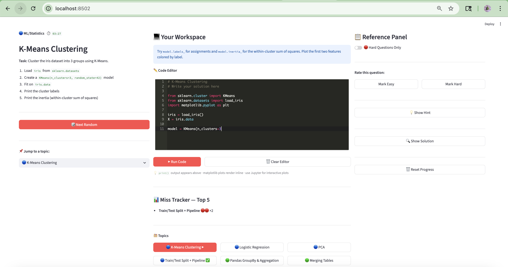

# 🧠 Python ML Reps

**Active-recall training for Python, ML, Pandas & Bioinformatics — 39 questions across 3 practice buckets, inline code editor, hint/solution panel.**



* Created by **[Yunhua Zhu](https://www.linkedin.com/in/zhu-yunhua/)**
  * GitHub: https://github.com/zhuy16
* Free software: MIT License

---

## Why

Speed in data science interviews and day-to-day work comes from **muscle memory**, not just knowing concepts.
This app gives you:

- **Active recall** — you see a prompt and have to produce the code from memory
- **Randomness** — questions appear in random order so you can't rely on sequence
- **Immediate feedback** — run your code inline, then compare against the hint and full solution
- **Spaced repetition** — mark questions Easy ✅ or Hard 🔴, then drill hard-only mode to focus on weak spots
- **Miss tracking** — the app counts how many times you've marked each topic Hard so you can see your blind spots

---

## What's inside

**39 questions** organised into three focused practice buckets.
Switch buckets with the radio selector at the top of the app.

### 🔵 Basic (10 questions)

Core ML and Python muscle memory.

| # | Topic | Category |
|---|-------|----------|
| 1 | K-Means Clustering | ML/Statistics |
| 2 | Logistic Regression | ML/Statistics |
| 3 | PCA — Dimensionality Reduction | ML/Statistics |
| 4 | Train/Test Split + Pipeline | ML/Statistics |
| 5 | Pandas GroupBy & Aggregation | Pandas/EDA |
| 6 | Merging Tables (SQL-style Joins) | Pandas/EDA |
| 7 | Handling Missing Values | Pandas/EDA |
| 8 | Plotting with Matplotlib & Seaborn | Pandas/EDA |
| 9 | Simple ML Metrics | ML/Statistics |
| 10 | Parsing Messy Files | Python Basics |

### 🧬 Bioinformatics Engineer (17 questions)

Practical genomics coding — DNA manipulation, variant tables, genomic file formats, and data structures. Focused on real bioinformatics engineering tasks.

| # | Topic | Category |
|---|-------|----------|
| 1 | Reverse Complement DNA | Strings |
| 2 | Count k-mers | Strings |
| 3 | Find Mutations (ref vs query) | Strings |
| 4 | Parse FASTA Text | Strings |
| 5 | Parse VCF Format | Strings |
| 6 | Parse FASTQ Reads | Strings |
| 7 | Count Variants by Gene | Hash Maps |
| 8 | Group Records by Sample ID | Hash Maps |
| 9 | Deduplicate Variant Records | Hash Maps |
| 10 | Top N Frequent Items | Hash Maps |
| 11 | Sort Variants by VAF | Lists/Sorting |
| 12 | Filter Variants (depth, VAF, consequence) | Lists/Sorting |
| 13 | Merge Genomic Intervals | Lists/Sorting |
| 14 | BED Interval Operations | Lists/Sorting |
| 15 | Pandas Variant Table Analysis | Pandas/EDA |
| 16 | Two Sum | Algorithms |
| 17 | Longest Substring Without Repeating | Algorithms |

### 🏥 Clinical DS (12 questions)

Clinical data science: pandas from memory, scikit-learn end-to-end, and survival analysis with `lifelines`.

| # | Topic | Category |
|---|-------|----------|
| 1 | Clinical DataFrame EDA | Pandas/EDA |
| 2 | GroupBy Clinical Outcomes | Pandas/EDA |
| 3 | Merge Patient Tables | Pandas/EDA |
| 4 | Derived Columns on Clinical Data | Pandas/EDA |
| 5 | Logistic Regression: Fit → Predict → Report | ML/Statistics |
| 6 | ROC Curve + AUC | ML/Statistics |
| 7 | sklearn Pipeline | ML/Statistics |
| 8 | Cross-Validation AUC | ML/Statistics |
| 9 | Kaplan-Meier Curve (Basic) | Survival Analysis |
| 10 | KM Curves by Treatment Arm | Survival Analysis |
| 11 | Log-Rank Test | Survival Analysis |
| 12 | Cox Proportional Hazards Model | Survival Analysis |

**App layout:**

```
┌──────────────────────────────────────────────────────────────────┐
│  🔵 Basic (ML / Python)  🧬 Bioinformatics Engineer  🏥 Clinical DS  │  ← bucket selector
└──────────────────────────────────────────────────────────────────┘
┌─────────────────┬──────────────────────────┬─────────────────────┐
│  LEFT           │  CENTER                  │  RIGHT              │
│  Task prompt    │  Ace code editor         │  💡 Show Hint       │
│  Category badge │  ▶ Run Code (inline)     │  🔍 Show Solution   │
│  ⏱️ Timer       │  Output + plots          │  ✅ Mark Easy       │
│  🎲 Next Random │  📊 Miss tracker         │  🔴 Mark Hard       │
│  📌 Jump to ... │  🗂️ Topic grid buttons   │  🔴 Hard-only mode  │
└─────────────────┴──────────────────────────┴─────────────────────┘
```

---

## Quick start

### 1. Clone

```bash
git clone https://github.com/zhuy16/python-ml-reps.git
cd python-ml-reps
```

### 2. Create a virtual environment and install dependencies

```bash
python3 -m venv .venv
source .venv/bin/activate       # Windows: .venv\Scripts\activate
pip install -r requirements.txt
```

### 3. Run the app

```bash
streamlit run apps/streamlit_app.py
```

The app opens automatically at **http://localhost:8501**.

> If port 8501 is already in use, run on a different port:
> ```bash
> streamlit run apps/streamlit_app.py --server.port 8502
> ```

---

## How to use

1. **Read the prompt** on the left — understand what you need to implement
2. **Write your solution** in the Ace editor (centre) — Tab inserts 4 spaces, syntax highlighting included
3. **Click ▶ Run Code** — `print()` output and matplotlib plots render inline
4. **Peek at 💡 Hint** on the right if you're stuck (shows key imports/approach)
5. **Reveal 🔍 Solution** to compare your answer against the full working code
6. **Rate it** — ✅ Easy if you nailed it, 🔴 Hard if you struggled
7. **Click 🎲 Next Random** or pick a specific topic from the dropdown / grid buttons
8. **Enable 🔴 Hard-Only mode** to drill only your weak spots

---

## Requirements

```
streamlit
streamlit-ace
scikit-learn
pandas
seaborn
matplotlib
numpy
lifelines
```

`lifelines` is required for the Kaplan-Meier, log-rank test, and Cox PH questions in the Clinical DS bucket.

---

## Author

Built in 2026 by [Yunhua Zhu](https://github.com/zhuy16).
